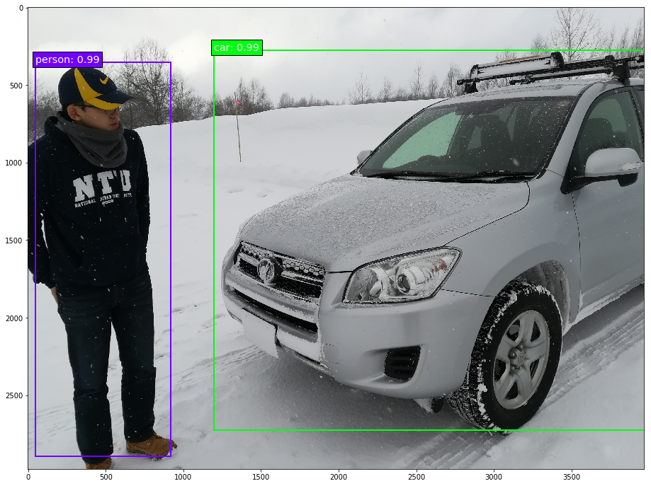
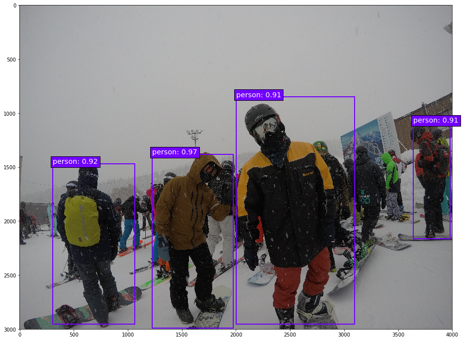
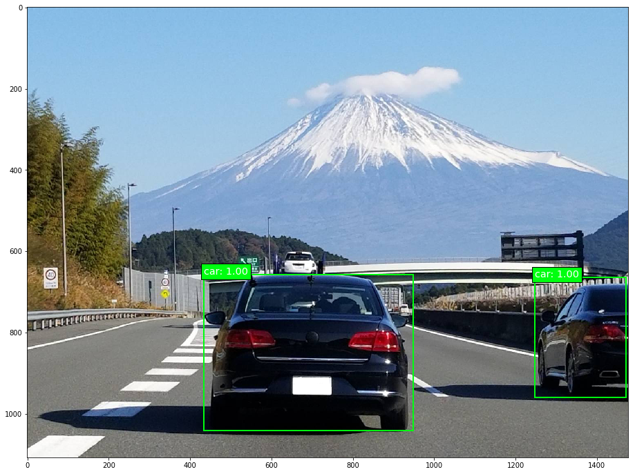
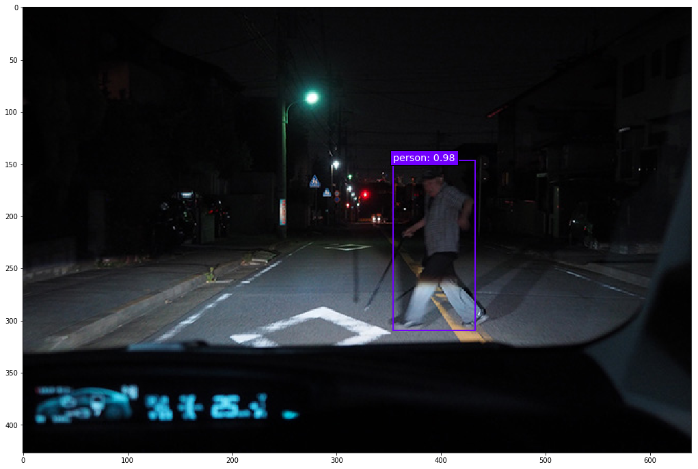

## SSD: Single-Shot MultiBox Detector implementation in Keras
---
### Contents

1. [Overview](#overview)
2. [Performance](#performance)
3. [Examples](#examples)
4. [Dependencies](#dependencies)
5. [How to use it](#how-to-use-it)
6. [Download the convolutionalized VGG-16 weights](#download-the-convolutionalized-vgg-16-weights)
7. [Download the original trained model weights](#download-the-original-trained-model-weights)
8. [How to fine-tune one of the trained models on your own dataset](#how-to-fine-tune-one-of-the-trained-models-on-your-own-dataset)
9. [ToDo](#todo)
10. [Important notes](#important-notes)
11. [Terminology](#terminology)

### Overview

This is a Keras port of the SSD model architecture introduced by Wei Liu et al. in the paper [SSD: Single Shot MultiBox Detector](https://arxiv.org/abs/1512.02325).

Ports of the trained weights of all the original models are provided below. This implementation is accurate, meaning that both the ported weights and models trained from scratch produce the same mAP values as the respective models of the original Caffe implementation (see performance section below).

The main goal of this project is to create an SSD implementation that is well documented for those who are interested in a low-level understanding of the model. The provided tutorials, documentation and detailed comments hopefully make it a bit easier to dig into the code and adapt or build upon the model than with most other implementations out there (Keras or otherwise) that provide little to no documentation and comments.

The repository currently provides the following network architectures:
* SSD300: [`keras_ssd300.py`](models/keras_ssd300.py)
* SSD512: [`keras_ssd512.py`](models/keras_ssd512.py)
* SSD7: [`keras_ssd7.py`](models/keras_ssd7.py) - a smaller 7-layer version that can be trained from scratch relatively quickly even on a mid-tier GPU, yet is capable enough for less complex object detection tasks and testing. You're obviously not going to get state-of-the-art results with that one, but it's fast.

If you would like to use one of the provided trained models for transfer learning (i.e. fine-tune one of the trained models on your own dataset), there is a [Jupyter notebook tutorial](weight_sampling_tutorial.ipynb) that helps you sub-sample the trained weights so that they are compatible with your dataset, see further below.

If you would like to build an SSD with your own base network architecture, you can use [`keras_ssd7.py`](models/keras_ssd7.py) as a template, it provides documentation and comments to help you.

### Performance

Here are the mAP evaluation results of the ported weights and below that the evaluation results of a model trained from scratch using this implementation. All models were evaluated using the official Pascal VOC test server (for 2012 `test`) or the official Pascal VOC Matlab evaluation script (for 2007 `test`). In all cases the results match (or slightly surpass) those of the original Caffe models. Download links to all ported weights are available further below.

<table width="70%">
  <tr>
    <td></td>
    <td colspan=3 align=center>Mean Average Precision</td>
  </tr>
  <tr>
    <td>evaluated on</td>
    <td colspan=2 align=center>VOC2007 test</td>
    <td align=center>VOC2012 test</td>
  </tr>
  <tr>
    <td>trained on<br>IoU rule</td>
    <td align=center width="25%">07+12<br>0.5</td>
    <td align=center width="25%">07+12+COCO<br>0.5</td>
    <td align=center width="25%">07++12+COCO<br>0.5</td>
  </tr>
  <tr>
    <td><b>SSD300</td>
    <td align=center><b>77.5</td>
    <td align=center><b>81.2</td>
    <td align=center><b>79.4</td>
  </tr>
  <tr>
    <td><b>SSD512</td>
    <td align=center><b>79.8</td>
    <td align=center><b>83.2</td>
    <td align=center><b>82.3</td>
  </tr>
</table>

Training an SSD300 from scratch to convergence on Pascal VOC 2007 `trainval` and 2012 `trainval` produces the same mAP on Pascal VOC 2007 `test` as the original Caffe SSD300 "07+12" model. You can find a summary of the training [here](training_summaries/ssd300_pascal_07+12_training_summary.md).

<table width="95%">
  <tr>
    <td></td>
    <td colspan=3 align=center>Mean Average Precision</td>
  </tr>
  <tr>
    <td></td>
    <td align=center>Original Caffe Model</td>
    <td align=center>Ported Weights</td>
    <td align=center>Trained from Scratch</td>
  </tr>
  <tr>
    <td><b>SSD300 "07+12"</td>
    <td align=center width="26%"><b>0.772</td>
    <td align=center width="26%"><b>0.775</td>
    <td align=center width="26%"><b><a href="https://drive.google.com/file/d/1-MYYaZbIHNPtI2zzklgVBAjssbP06BeA/view">0.771</a></td>
  </tr>
</table>

The models achieve the following average number of frames per second (FPS) on Pascal VOC on an NVIDIA GeForce GTX 1070 mobile (i.e. the laptop version) and cuDNN v6. There are two things to note here. First, note that the benchmark prediction speeds of the original Caffe implementation were achieved using a TitanX GPU and cuDNN v4. Second, the paper says they measured the prediction speed at batch size 8, which I think isn't a meaningful way of measuring the speed. The whole point of measuring the speed of a detection model is to know how many individual sequential images the model can process per second, therefore measuring the prediction speed on batches of images and then deducing the time spent on each individual image in the batch defeats the purpose. For the sake of comparability, below you find the prediction speed for the original Caffe SSD implementation and the prediction speed for this implementation under the same conditions, i.e. at batch size 8. In addition you find the prediction speed for this implementation at batch size 1, which in my opinion is the more meaningful number.

<table width>
  <tr>
    <td></td>
    <td colspan=3 align=center>Frames per Second</td>
  </tr>
  <tr>
    <td></td>
    <td align=center>Original Caffe Implementation</td>
    <td colspan=2 align=center>This Implementation</td>
  </tr>
  <tr>
    <td width="14%">Batch Size</td>
    <td width="27%" align=center>8</td>
    <td width="27%" align=center>8</td>
    <td width="27%" align=center>1</td>
  </tr>
  <tr>
    <td><b>SSD300</td>
    <td align=center><b>46</td>
    <td align=center><b>49</td>
    <td align=center><b>39</td>
  </tr>
  <tr>
    <td><b>SSD512</td>
    <td align=center><b>19</td>
    <td align=center><b>25</td>
    <td align=center><b>20</td>
  </tr>
  <tr>
    <td><b>SSD7</td>
    <td align=center><b></td>
    <td align=center><b>216</td>
    <td align=center><b>127</td>
  </tr>
</table>

### Examples

Below are some prediction examples of the fully trained original SSD300 "07+12" model (i.e. trained on Pascal VOC2007 `trainval` and VOC2012 `trainval`). The predictions were made on Pascal VOC2007 `test`.

| | |
|---|---|
|  |  |
|  |  |

And some pictures from my smart-phone are predicted:

| | |
|---|---|
|  |  |
|  |  |

Here are some prediction examples of an SSD7 (i.e. the small 7-layer version) partially trained on two road traffic datasets released by [Udacity](https://github.com/udacity/self-driving-car/tree/master/annotations) with roughly 20,000 images in total and 5 object categories (more info in [`ssd7_training.ipynb`](ssd7_training.ipynb)). The predictions you see below were made after 10,000 training steps at batch size 32. Admittedly, cars are comparatively easy objects to detect and I picked a few of the better examples, but it is nonetheless remarkable what such a small model can do after only 10,000 training iterations.

| | |
|---|---|
|  |  |
|  |  |

### Dependencies

* Python 3.x
* Numpy
* TensorFlow 1.x
* Keras 2.x
* OpenCV
* Beautiful Soup 4.x

The Theano and CNTK backends are currently not supported.

Python 2 compatibility: This implementation seems to work with Python 2.7, but I don't provide any support for it. It's 2018 and nobody should be using Python 2 anymore.

### How to use it

This repository provides Jupyter notebook tutorials that explain training, inference and evaluation, and there are a bunch of explanations in the subsequent sections that complement the notebooks.

How to use a trained model for inference:
* [`ssd300_inference.ipynb`](ssd300_inference.ipynb)
* [`ssd512_inference.ipynb`](ssd512_inference.ipynb)

How to train a model:
* [`ssd300_training.ipynb`](ssd300_training.ipynb)
* [`ssd7_training.ipynb`](ssd7_training.ipynb)

How to use one of the provided trained models for transfer learning on your own dataset:
* [Read below](#how-to-fine-tune-one-of-the-trained-models-on-your-own-dataset)

How to evaluate a trained model:
* In general: [`ssd300_evaluation.ipynb`](ssd300_evaluation.ipynb)
* On MS COCO: [`ssd300_evaluation_COCO.ipynb`](ssd300_evaluation_COCO.ipynb)

How to use the data generator:
* The data generator used here has its own repository with a detailed tutorial [here](https://github.com/pierluigiferrari/data_generator_object_detection_2d)

#### Training details

The general training setup is layed out and explained in [`ssd7_training.ipynb`](ssd7_training.ipynb) and in [`ssd300_training.ipynb`](ssd300_training.ipynb). The setup and explanations are similar in both notebooks for the most part, so it doesn't matter which one you look at to understand the general training setup, but the parameters in [`ssd300_training.ipynb`](ssd300_training.ipynb) are preset to copy the setup of the original Caffe implementation for training on Pascal VOC, while the parameters in [`ssd7_training.ipynb`](ssd7_training.ipynb) are preset to train on the [Udacity traffic datasets](https://github.com/udacity/self-driving-car/tree/master/annotations).

To train the original SSD300 model on Pascal VOC:

1. Download the datasets:
  ```c
  wget http://host.robots.ox.ac.uk/pascal/VOC/voc2012/VOCtrainval_11-May-2012.tar
  wget http://host.robots.ox.ac.uk/pascal/VOC/voc2007/VOCtrainval_06-Nov-2007.tar
  wget http://host.robots.ox.ac.uk/pascal/VOC/voc2007/VOCtest_06-Nov-2007.tar
  ```
2. Download the weights for the convolutionalized VGG-16 or for one of the trained original models provided below.
3. Set the file paths for the datasets and model weights accordingly in [`ssd300_training.ipynb`](ssd300_training.ipynb) and execute the cells.

The procedure for training SSD512 is the same of course. It is imperative that you load the pre-trained VGG-16 weights when attempting to train an SSD300 or SSD512 from scratch, otherwise the training will probably fail. Here is a summary of a full training of the SSD300 "07+12" model for comparison with your own training:

* [SSD300 Pascal VOC "07+12" training summary](training_summaries/ssd300_pascal_07+12_training_summary.md)

#### Encoding and decoding boxes

The [`ssd_encoder_decoder`](ssd_encoder_decoder) sub-package contains all functions and classes related to encoding and decoding boxes. Encoding boxes means converting ground truth labels into the target format that the loss function needs during training. It is this encoding process in which the matching of ground truth boxes to anchor boxes (the paper calls them default boxes and in the original C++ code they are called priors - all the same thing) happens. Decoding boxes means converting raw model output back to the input label format, which entails various conversion and filtering processes such as non-maximum suppression (NMS).

In order to train the model, you need to create an instance of `SSDInputEncoder` that needs to be passed to the data generator. The data generator does the rest, so you don't usually need to call any of `SSDInputEncoder`'s methods manually.

Models can be created in 'training' or 'inference' mode. In 'training' mode, the model outputs the raw prediction tensor that still needs to be post-processed with coordinate conversion, confidence thresholding, non-maximum suppression, etc. The functions `decode_detections()` and `decode_detections_fast()` are responsible for that. The former follows the original Caffe implementation, which entails performing NMS per object class, while the latter performs NMS globally across all object classes and is thus more efficient, but also behaves slightly differently. Read the documentation for details about both functions. If a model is created in 'inference' mode, its last layer is the `DecodeDetections` layer, which performs all the post-processing that `decode_detections()` does, but in TensorFlow. That means the output of the model is already the post-processed output. In order to be trainable, a model must be created in 'training' mode. The trained weights can then later be loaded into a model that was created in 'inference' mode.

A note on the anchor box offset coordinates used internally by the model: This may or may not be obvious to you, but it is important to understand that it is not possible for the model to predict absolute coordinates for the predicted bounding boxes. In order to be able to predict absolute box coordinates, the convolutional layers responsible for localization would need to produce different output values for the same object instance at different locations within the input image. This isn't possible of course: For a given input to the filter of a convolutional layer, the filter will produce the same output regardless of the spatial position within the image because of the shared weights. This is the reason why the model predicts offsets to anchor boxes instead of absolute coordinates, and why during training, absolute ground truth coordinates are converted to anchor box offsets in the encoding process. The fact that the model predicts offsets to anchor box coordinates is in turn the reason why the model contains anchor box layers that do nothing but output the anchor box coordinates so that the model's output tensor can include those. If the model's output tensor did not contain the anchor box coordinates, the information to convert the predicted offsets back to absolute coordinates would be missing in the model output.

#### Using a different base network architecture

If you want to build a different base network architecture, you could use [`keras_ssd7.py`](models/keras_ssd7.py) as a template. It provides documentation and comments to help you turn it into a different base network. Put together the base network you want and add a predictor layer on top of each network layer from which you would like to make predictions. Create two predictor heads for each, one for localization, one for classification. Create an anchor box layer for each predictor layer and set the respective localization head's output as the input for the anchor box layer. The structure of all tensor reshaping and concatenation operations remains the same, you just have to make sure to include all of your predictor and anchor box layers of course.

### Download the convolutionalized VGG-16 weights

In order to train an SSD300 or SSD512 from scratch, download the weights of the fully convolutionalized VGG-16 model trained to convergence on ImageNet classification here:

[`VGG_ILSVRC_16_layers_fc_reduced.h5`](https://drive.google.com/open?id=1sBmajn6vOE7qJ8GnxUJt4fGPuffVUZox).

As with all other weights files below, this is a direct port of the corresponding `.caffemodel` file that is provided in the repository of the original Caffe implementation.

### Download the original trained model weights

Here are the ported weights for all the original trained models. The filenames correspond to their respective `.caffemodel` counterparts. The asterisks and footnotes refer to those in the README of the [original Caffe implementation](https://github.com/weiliu89/caffe/tree/ssd#models).

1. PASCAL VOC models:

    * 07+12: [SSD300*](https://drive.google.com/open?id=121-kCXaOHOkJE_Kf5lKcJvC_5q1fYb_q), [SSD512*](https://drive.google.com/open?id=19NIa0baRCFYT3iRxQkOKCD7CpN6BFO8p)
    * 07++12: [SSD300*](https://drive.google.com/open?id=1M99knPZ4DpY9tI60iZqxXsAxX2bYWDvZ), [SSD512*](https://drive.google.com/open?id=18nFnqv9fG5Rh_fx6vUtOoQHOLySt4fEx)
    * COCO[1]: [SSD300*](https://drive.google.com/open?id=17G1J4zEpFwiOzgBmq886ci4P3YaIz8bY), [SSD512*](https://drive.google.com/open?id=1wGc368WyXSHZOv4iow2tri9LnB0vm9X-)
    * 07+12+COCO: [SSD300*](https://drive.google.com/open?id=1vtNI6kSnv7fkozl7WxyhGyReB6JvDM41), [SSD512*](https://drive.google.com/open?id=14mELuzm0OvXnwjb0mzAiG-Ake9_NP_LQ)
    * 07++12+COCO: [SSD300*](https://drive.google.com/open?id=1fyDDUcIOSjeiP08vl1WCndcFdtboFXua), [SSD512*](https://drive.google.com/open?id=1a-64b6y6xsQr5puUsHX_wxI1orQDercM)


2. COCO models:

    * trainval35k: [SSD300*](https://drive.google.com/open?id=1vmEF7FUsWfHquXyCqO17UaXOPpRbwsdj), [SSD512*](https://drive.google.com/open?id=1IJWZKmjkcFMlvaz2gYukzFx4d6mH3py5)


3. ILSVRC models:

    * trainval1: [SSD300*](https://drive.google.com/open?id=1VWkj1oQS2RUhyJXckx3OaDYs5fx2mMCq), [SSD500](https://drive.google.com/open?id=1LcBPsd9CJbuBw4KiSuE1o1fMA-Pz2Zvw)

### How to fine-tune one of the trained models on your own dataset

If you want to fine-tune one of the provided trained models on your own dataset, chances are your dataset doesn't have the same number of classes as the trained model. The following tutorial explains how to deal with this problem:

[`weight_sampling_tutorial.ipynb`](weight_sampling_tutorial.ipynb)

### ToDo

The following things are on the to-do list, ranked by priority. Contributions are welcome, but please read the [contributing guidelines](CONTRIBUTING.md).

1. Add model definitions and trained weights for SSDs based on other base networks such as MobileNet, InceptionResNetV2, or DenseNet.
2. Add support for the Theano and CNTK backends. Requires porting the custom layers and the loss function from TensorFlow to the abstract Keras backend.

Currently in the works:

* A new [Focal Loss](https://arxiv.org/abs/1708.02002) loss function.

### Important notes

* All trained models that were trained on MS COCO use the smaller anchor box scaling factors provided in all of the Jupyter notebooks. In particular, note that the '07+12+COCO' and '07++12+COCO' models use the smaller scaling factors.

### Terminology

* "Anchor boxes": The paper calls them "default boxes", in the original C++ code they are called "prior boxes" or "priors", and the Faster R-CNN paper calls them "anchor boxes". All terms mean the same thing, but I slightly prefer the name "anchor boxes" because I find it to be the most descriptive of these names. I call them "prior boxes" or "priors" in `keras_ssd300.py` and `keras_ssd512.py` to stay consistent with the original Caffe implementation, but everywhere else I use the name "anchor boxes" or "anchors".
* "Labels": For the purpose of this project, datasets consist of "images" and "labels". Everything that belongs to the annotations of a given image is the "labels" of that image: Not just object category labels, but also bounding box coordinates. "Labels" is just shorter than "annotations". I also use the terms "labels" and "targets" more or less interchangeably throughout the documentation, although "targets" means labels specifically in the context of training.
* "Predictor layer": The "predictor layers" or "predictors" are all the last convolution layers of the network, i.e. all convolution layers that do not feed into any subsequent convolution layers.
